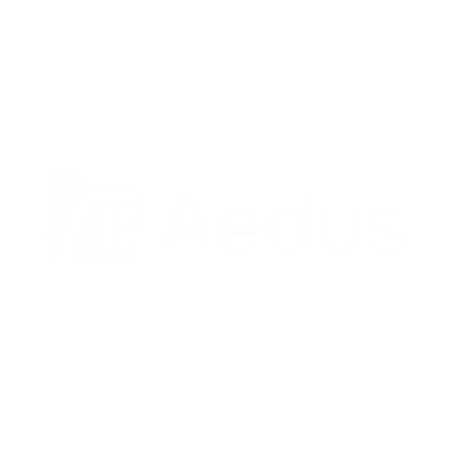

# Aedus

  

AedusApp es una herramienta sencilla para gestionar incidencias en institutos. Permite a los profesores reportar problemas y a los administradores resolverlos y gestionar los usuarios.

### Funcionalidades
*   📋 **Gestión de Incidencias:** Reporte y seguimiento de problemas.
*   👥 **Gestión de Usuarios:** Roles de Administrador y Profesor.
*   🛠️ **Recursos:** Control de inventario (en desarrollo).

Creado por Mario.

